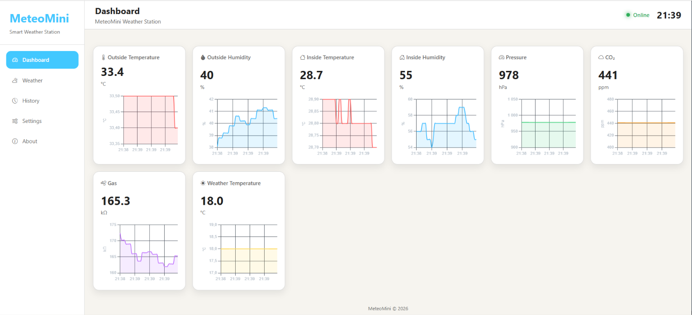
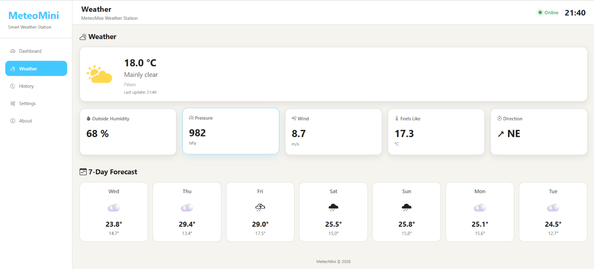
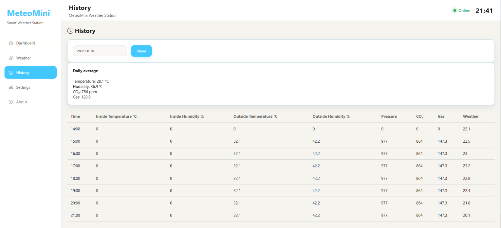
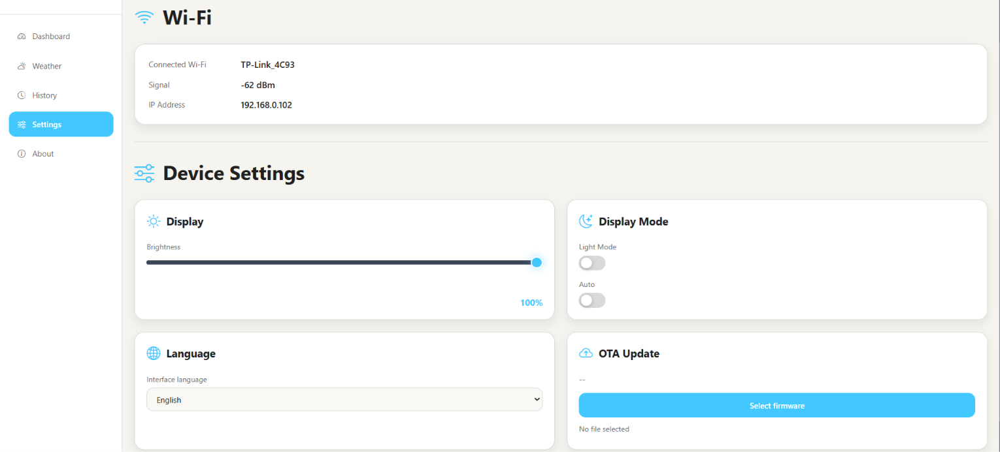
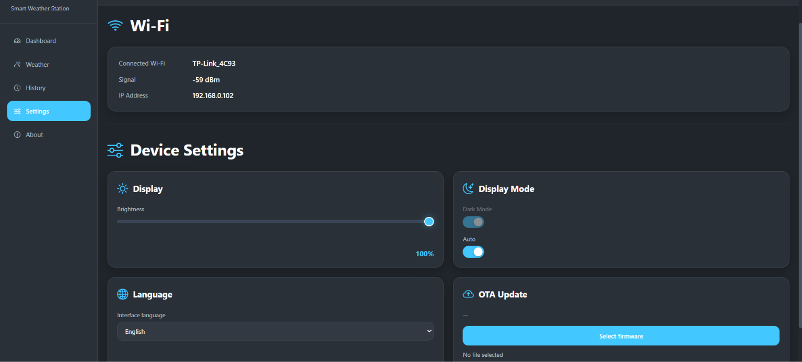
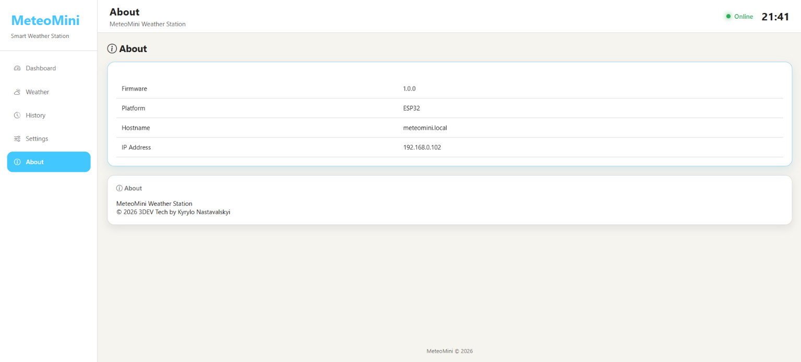

# MeteoMini — Smart Weather Station

## 1. Project Overview

MeteoMini is a compact IoT-based weather station designed for real-time environmental monitoring, data visualization and historical analysis.

The system combines embedded electronics, environmental sensors, a local display and a web-based interface. Sensor data is collected by the embedded controller, processed by the firmware and presented to the user through the local display and web dashboard.

The web interface provides several functional sections, including Dashboard, Weather, History, Settings and About. These sections allow the user to monitor current environmental conditions, review historical measurements and configure the system.

The local display provides direct access to the current measurements. MeteoMini also includes Day and Night display modes to provide a more comfortable interface under different lighting conditions.

The project is designed as a modular platform that can be extended with additional sensors, monitoring functions and software features.

---

## 2. System Architecture

MeteoMini consists of several interconnected subsystems:

* **Embedded Controller** — controls the sensors, processes measurements and manages the system logic.
* **Environmental Sensors** — collect physical weather parameters from the surrounding environment.
* **Local Display** — provides real-time information directly on the device.
* **Web Interface** — provides remote access to measurements and system functions.
* **Data History** — stores previously collected measurements for later analysis.
* **Configuration System** — allows the user to adjust available system parameters.

The general data flow can be represented as:

**Sensors → Embedded Controller → Data Processing → Display / Web Interface → Historical Data**

---

## 3. Hardware Architecture

MeteoMini uses a distributed architecture based on two ESP32 microcontrollers: an **Outdoor Unit** and a **Main Unit**.

The Outdoor Unit is responsible for collecting environmental measurements outside the building. The Main Unit acts as the central controller, receiving outdoor measurements, collecting local measurements, storing historical data and providing the user interface.

### 3.1 Outdoor Unit

The Outdoor Unit is based on an ESP32 microcontroller and is designed for outdoor environmental monitoring.

It uses two sensors:

* **SCD41** — measures CO₂ concentration, temperature and relative humidity.
* **BME680** — measures temperature, relative humidity, atmospheric pressure and gas resistance.

The ESP32 periodically reads the sensor values and transmits the measurements to the Main Unit using the **ESP-NOW** wireless communication protocol.

This architecture allows the Outdoor Unit to be installed separately from the Main Unit while maintaining a direct wireless connection between the two devices.

### 3.2 Main Unit

The Main Unit is based on a second ESP32 microcontroller and acts as the central processing unit of MeteoMini.

The Main Unit receives measurements from the Outdoor Unit through ESP-NOW and also collects local environmental data using a **DHT11** sensor.

The Main Unit is responsible for:

* receiving outdoor sensor measurements;
* reading local sensor data;
* processing and combining measurements;
* storing historical data;
* serving the web interface;
* handling user commands and configuration;
* controlling the local display.

### 3.3 Local Display

The Main Unit is connected to a **2.0-inch 320×240 IPS color display based on the ST7789 controller**.

The display uses the **SPI interface** and provides a local user interface for viewing current measurements and system information.

MeteoMini supports different display modes, including a dedicated Night Mode for operation in low-light conditions.

### 3.4 W25Q32 Flash Memory

The Main Unit uses an external **W25Q32 SPI flash memory** as non-volatile storage.

The W25Q32 is used for two main purposes:

1. **Web Interface Storage** — the HTML, CSS, JavaScript and other required web-interface resources are stored directly in the flash memory.
2. **Historical Data Storage** — recorded environmental measurements are stored in the same memory and are later used by the History section of the interface.

This approach allows the MeteoMini web interface and historical measurement data to be stored locally on the device without requiring an external server or database.

### 3.5 Wi-Fi Web Server

The Main ESP32 operates as a local web server and provides access to the MeteoMini web interface through Wi-Fi.

The web interface is stored in the W25Q32 flash memory and is served directly by the Main ESP32. Users can connect to the station over Wi-Fi using a web browser to monitor measurements and control available system functions.

The web interface provides access to the Dashboard, Weather, History, Settings and About sections.

### 3.6 Wireless Communication

Communication between the Outdoor Unit and Main Unit is implemented using **ESP-NOW**.

The Outdoor ESP32 collects data from the SCD41 and BME680 sensors and transmits the measurements to the Main ESP32.

The Main ESP32 receives the data and combines it with measurements from the local DHT11 sensor. The processed data is then used by the display, web interface and historical data storage.

### 3.7 Overall Data Flow

The complete system data flow can be represented as follows:

**SCD41 + BME680**
↓
**Outdoor ESP32**
↓
**ESP-NOW**
↓
**Main ESP32**
↑
**DHT11**

**Main ESP32**
↓
**W25Q32** → Web Interface + Historical Data

**Main ESP32**
↓
**ST7789 Display**

**Main ESP32**
↕

## 3. Hardware Architecture

### 4.1 Outdoor ESP32

The Outdoor Unit is controlled by an ESP32 microcontroller. Its primary function is to acquire environmental data from the SCD41 and BME680 sensors and transmit the measurements to the Main Unit.

The ESP32 communicates with the sensors, performs the initial processing of the measurements and prepares the data packet for wireless transmission.

Communication with the Main Unit is performed using ESP-NOW. This allows the Outdoor Unit to operate as an independent measurement node without requiring a permanent connection to the local web interface.

The Outdoor ESP32 is therefore responsible for:

- sensor data acquisition;
- initial data processing;
- measurement packet preparation;
- wireless transmission via ESP-NOW;
- periodic measurement updates.

- ### 4.2 SCD41 CO₂ Sensor

The SCD41 is used in the Outdoor Unit for environmental monitoring. It provides measurements of:

- CO₂ concentration;
- temperature;
- relative humidity.

The sensor is connected to the Outdoor ESP32 and its measurements are periodically read by the firmware.

The CO₂ measurement provides an additional environmental parameter that is not available from the BME680 or DHT11 sensors. Temperature and humidity data from the SCD41 can also be used as additional environmental measurements and for comparison with the other sensors.

The collected SCD41 data is transmitted to the Main Unit together with the measurements from the BME680.
**Wi-Fi**
↕
**User Web Browser**

### 4.3 BME680 Environmental Sensor

The BME680 is used as the second environmental sensor in the Outdoor Unit.

It provides measurements related to:

- temperature;
- relative humidity;
- atmospheric pressure;
- gas resistance.

The ESP32 periodically reads the BME680 measurements and includes the available values in the data packet transmitted to the Main Unit.

Using the BME680 together with the SCD41 allows the Outdoor Unit to collect a wider range of environmental parameters from a single location.

### 4.4 Main ESP32

The Main ESP32 is the central controller of the MeteoMini system.

It receives measurement packets from the Outdoor ESP32 through ESP-NOW and simultaneously reads the local DHT11 sensor.

The Main ESP32 processes the received and local measurements and makes the resulting data available to the rest of the system.

Its main functions include:

- receiving Outdoor Unit measurements;
- reading the local DHT11 sensor;
- processing measurement data;
- controlling the ST7789 display;
- managing W25Q32 flash memory;
- storing historical measurements;
- serving the web interface;
- processing commands received from the web interface;
- managing system settings;
- providing Wi-Fi connectivity for user access.

- ### 4.5 DHT11 Local Sensor

The DHT11 is installed in the Main Unit and provides local temperature and relative humidity measurements.

Unlike the SCD41 and BME680, which are installed in the Outdoor Unit, the DHT11 measures the environmental conditions at the location of the Main Unit.

The Main ESP32 reads the DHT11 data and combines it with the measurements received from the Outdoor Unit.

This allows MeteoMini to monitor environmental conditions at two different locations within the same system.

### 4.6 W25Q32 Flash Memory

The W25Q32 is an external non-volatile SPI flash memory connected to the Main ESP32.

It is used as local storage for two major parts of the MeteoMini system:

1. Web interface resources.
2. Historical measurement data.

The web application files are stored directly in the W25Q32 and served by the Main ESP32 when a user connects to the station through Wi-Fi.

Historical sensor measurements are also stored in the same flash memory. The stored data can later be accessed through the History section of the web interface.

Using external flash memory provides persistent local storage while keeping the system independent of an external database or cloud service.

### 4.7 ST7789 IPS Display

The Main Unit uses a 2.0-inch 320×240 IPS color display based on the ST7789 controller.

The display is connected to the Main ESP32 using the SPI interface.

It provides a local graphical user interface for displaying current measurements and system information.

The display supports different visual modes, including Day Mode and Night Mode. This allows the same interface to be used during both normal daytime operation and in low-light environments.

### 4.8 ESP-NOW Communication

ESP-NOW is used as the wireless communication protocol between the Outdoor ESP32 and the Main ESP32.

The Outdoor Unit acts as the measurement node and periodically transmits sensor data to the Main Unit.

The Main Unit receives the data and integrates it with measurements from the local DHT11 sensor.

The communication architecture can therefore be summarized as:

  <b>Outdoor ESP32 → ESP-NOW → Main ESP32</b>

This separation allows the measurement hardware to be located outdoors while the main processing, storage, display and user interface remain in the Main Unit.

### 4.9 Wi-Fi and Web Server

The Main ESP32 creates and operates the MeteoMini web server.

Users can connect to the Main Unit through Wi-Fi using a standard web browser. The web application is stored locally in the W25Q32 flash memory and is served directly by the Main ESP32.

The web interface provides access to:

- current measurements;
- weather information;
- historical data;
- system settings;
- display modes;
- system information.

The web interface also provides control functions, allowing the user to configure available system parameters remotely without directly interacting with the embedded hardware.

# 5. Pinout & Wiring

This section documents the electrical connections between the ESP32 controllers and the sensors, display and external flash memory.

## 5.1 Outdoor Unit — ESP32 + BME680

The BME680 is connected to the Outdoor ESP32 using the I²C interface.

| ESP32 OUTDOOR | BME680 | Function  |
| ------------- | ------ | --------- |
| 3.3V          | VCC    | Power     |
| GND           | GND    | Ground    |
| GPIO22        | SCL    | I²C Clock |
| GPIO21        | SDA    | I²C Data  |

## 5.2 Outdoor Unit — ESP32 + SCD41

The SCD41 is connected to the same I²C bus as the BME680.

| ESP32 OUTDOOR | SCD41 | Function  |
| ------------- | ----- | --------- |
| 3.3V          | VCC   | Power     |
| GND           | GND   | Ground    |
| GPIO22        | SCL   | I²C Clock |
| GPIO21        | SDA   | I²C Data  |

Both sensors share the same I²C bus:

**GPIO22 → SCL**
**GPIO21 → SDA**

## 5.3 Main Unit — ESP32 + ST7789 Display

The Main Unit uses a 2.0-inch 320×240 IPS color display based on the ST7789 controller.

| ST7789 Display | ESP32 Main | Function          |
| -------------- | ---------- | ----------------- |
| VCC            | 3.3V       | Power             |
| GND            | GND        | Ground            |
| CLK            | GPIO18     | SPI Clock         |
| SDA / MOSI     | GPIO23     | SPI Data          |
| CS             | GPIO15     | Chip Select       |
| DC             | GPIO2      | Data / Command    |
| RST            | GPIO4      | Reset             |
| BLK            | GPIO32     | Backlight Control |

## 5.4 Main Unit — ESP32 + DHT11

The DHT11 is connected to the Main ESP32 as a local temperature and humidity sensor.

| DHT11    | ESP32 Main | Function    |
| -------- | ---------- | ----------- |
| VCC (+)  | 3.3V       | Power       |
| D (DATA) | GPIO27     | Sensor Data |
| GND (-)  | GND        | Ground      |

## 5.5 Main Unit — ESP32 + W25Q32

The W25Q32 external flash memory is connected to the Main ESP32 using SPI.

| W25Q32 Module | ESP32 Main | Function    |
| ------------- | ---------- | ----------- |
| VCC           | 3.3V       | Power       |
| GND           | GND        | Ground      |
| CLK           | GPIO25     | SPI Clock   |
| DI            | GPIO26     | MOSI        |
| D0            | GPIO14     | MISO        |
| CS            | GPIO21     | Chip Select |

## 5.6 Interface Summary

| Interface | ESP32 Unit     | Connected Devices | GPIO                                    |
| --------- | -------------- | ----------------- | --------------------------------------- |
| I²C       | Outdoor        | SCD41 + BME680    | SDA: GPIO21, SCL: GPIO22                |
| SPI       | Main           | ST7789            | CLK: GPIO18, MOSI: GPIO23               |
| SPI       | Main           | W25Q32            | CLK: GPIO25, MOSI: GPIO26, MISO: GPIO14 |
| Digital   | Main           | DHT11             | GPIO27                                  |
| ESP-NOW   | Outdoor ↔ Main | ESP32 ↔ ESP32     | Wireless                                |
| Wi-Fi     | Main           | Web Browser       | Wireless                                |

# 6. Software Architecture

The MeteoMini software is divided into two embedded firmware components and a local web application.

The **Outdoor ESP32 firmware** is responsible for sensor acquisition and wireless transmission. The **Main ESP32 firmware** acts as the central application controller, manages local hardware, stores measurement data and provides the web interface.

## 6.1 Outdoor Unit Firmware

The Outdoor ESP32 firmware is responsible for collecting environmental data from the SCD41 and BME680 sensors.

The firmware periodically performs the following operations:

1. Initializes the connected sensors.
2. Reads the current measurements from the SCD41.
3. Reads the current measurements from the BME680.
4. Processes the acquired sensor values.
5. Creates a measurement data packet.
6. Transmits the packet to the Main ESP32 using ESP-NOW.
7. Repeats the measurement cycle.

The Outdoor Unit operates independently from the user interface. Its primary purpose is reliable acquisition and transmission of outdoor environmental measurements.

## 6.2 Main Unit Firmware

The Main ESP32 firmware is the central software component of MeteoMini.

It performs several tasks simultaneously:

* receives measurements from the Outdoor ESP32;
* reads the local DHT11 sensor;
* processes measurement data;
* controls the ST7789 display;
* manages the W25Q32 flash memory;
* stores historical measurements;
* runs the local web server;
* serves the web application;
* processes commands received from the web interface;
* manages system settings.

The Main Unit combines data received from the Outdoor Unit with measurements from the local DHT11 and makes the resulting information available to both the local display and the web interface.

## 6.3 ESP-NOW Communication

ESP-NOW is used as the communication layer between the two ESP32 controllers.

The Outdoor ESP32 acts as the transmitting node, while the Main ESP32 acts as the receiving node.

The Outdoor Unit sends a structured measurement packet containing the available sensor values. The Main Unit receives the packet and updates the corresponding environmental parameters.

The communication path is:

  <b>Outdoor Sensors → Outdoor ESP32 → ESP-NOW → Main ESP32</b>

This architecture separates outdoor measurement acquisition from the main processing and user-interface functions.

## 6.4 Measurement Processing

After receiving data from the Outdoor Unit, the Main ESP32 processes the measurements together with the local DHT11 data.

The resulting dataset represents the current state of the monitored environment and is used by several system components:

* local display;
* web Dashboard;
* Weather page;
* historical data storage;
* other system functions requiring current measurements.

The Main ESP32 therefore acts as the central data processing point of the system.

## 6.5 W25Q32 Data Storage

The W25Q32 flash memory provides persistent local storage for the MeteoMini application.

Two main types of data are stored in the flash memory:

### Web Application

The web interface resources are stored locally on the W25Q32. The Main ESP32 reads these resources from the flash memory and serves them to connected clients through the local web server.

### Historical Measurements

Measurement records are also stored in the W25Q32. The stored records are used by the History section of the web interface to display previously collected environmental data.

This architecture allows MeteoMini to operate without an external database or cloud storage service.

## 6.6 Local Web Server

The Main ESP32 runs the MeteoMini web server directly.

When a user connects to the station through Wi-Fi, the ESP32 serves the web application stored in the W25Q32.

The browser-based interface communicates with the Main ESP32 to obtain current measurements and perform available control and configuration operations.

The web server therefore provides the connection between the embedded system and the user.

## 6.7 Web Application

The MeteoMini web application provides a graphical interface for monitoring and controlling the station.

The main sections are:

* **Dashboard** — general overview of the system and current measurements.
* **Weather** — detailed current environmental information.
* **History** — previously recorded measurements.
* **Settings** — system configuration and available controls.
* **About** — general information about the MeteoMini system.

The web application is stored locally in the W25Q32 and does not require a separate web server.

## 6.8 Local Display Interface

The Main ESP32 also controls the ST7789 display.

The display provides a local interface for viewing current measurements and system information without accessing the web interface.

The firmware manages the display content and supports different visual modes, including Day Mode and Night Mode.

## 6.9 Software Data Flow

The overall software data flow can be summarized as:

  <b>
  Sensors 
  ↓ 
  Outdoor ESP32 
  ↓ 
  ESP-NOW 
  ↓ 
  Main ESP32 
  ↙ ↓ ↘ 
  Display · W25Q32 · Web Server 
  ↓ &nbsp;&nbsp;&nbsp;&nbsp;&nbsp;&nbsp;&nbsp;&nbsp;&nbsp;&nbsp; ↓ 
  Local UI &nbsp;&nbsp;&nbsp;&nbsp;&nbsp; Web Browser
  </b>

# 7. Web Interface

The MeteoMini web interface is hosted directly on the Main ESP32 and stored in the external W25Q32 flash memory. The ESP32 operates as a local web server and provides access to the interface through Wi-Fi.

The interface is designed to provide real-time monitoring, historical data access and configuration of the weather station from a standard web browser.

## 7.1 Dashboard

The Dashboard is the main screen of the MeteoMini web interface. It provides a quick overview of the current system status and the available environmental measurements.

The Dashboard is designed to present the most important information in a compact format, allowing the user to check the current state of the station without navigating through multiple pages.

  

  <b>Figure 8. MeteoMini Dashboard</b>

## 7.2 Weather

The Weather section provides detailed information about the current environmental conditions measured by the MeteoMini system.

Measurements received from the Outdoor Unit and measurements collected by the Main Unit are processed by the Main ESP32 and made available through the web interface.

This section provides the user with a more detailed view of the current environmental conditions.

  

  <b>Figure 9. Weather Monitoring Interface</b>

## 7.3 History

The History section provides access to previously recorded environmental measurements.

Measurement data is stored locally in the W25Q32 flash memory. The Main ESP32 reads the stored records and provides them to the web application for visualization.

This allows the user to review changes in environmental conditions over time without relying on an external database or cloud service.

  

  <b>Figure 10. Historical Weather Data</b>

## 7.4 Settings

The Settings section provides access to available system configuration options.

The user can interact with the Main ESP32 through the web interface without directly accessing the hardware. Configuration commands are received by the ESP32 through the local Wi-Fi connection and applied by the firmware.

  

  <b>Figure 11. MeteoMini Settings Interface</b>

## 7.5 Night Mode

MeteoMini provides a dedicated Night Mode for operation in low-light environments.

Night Mode changes the visual presentation of the interface to reduce the brightness and improve usability during nighttime operation.

The mode is available as part of the station's user-interface functionality.

  

  <b>Figure 12. MeteoMini Night Mode</b>

## 7.6 About

The About section provides general information about the MeteoMini system and its software.

It serves as an information page within the web application and provides the user with basic project and system information.

  

  <b>Figure 13. MeteoMini About Section</b>

## 7.7 Web Interface Architecture

The web interface is served entirely by the Main ESP32.

The basic communication process is:

  <b>Web Browser → Wi-Fi → Main ESP32 → W25Q32 / Sensors / System Data</b>

The Main ESP32 handles incoming web requests, accesses the required system data or configuration parameters and returns the appropriate response to the connected browser.

Because the web application is stored locally on the W25Q32, MeteoMini does not require an external web server to operate its user interface.

# 8. Data Management & Storage

MeteoMini uses local non-volatile storage to keep the web application and historical environmental measurements directly on the Main Unit.

The external **W25Q32 SPI flash memory** is connected to the Main ESP32 and provides persistent storage for the system.

## 8.1 W25Q32 Storage

The W25Q32 is used for two primary purposes:

* storing the MeteoMini web application;
* storing historical measurement data.

Using the same external flash memory for both functions allows the complete application and its measurement history to remain locally available on the device.

The system does not require an external database or cloud storage service for normal operation.

## 8.2 Web Application Storage

The web interface resources are stored in the W25Q32 flash memory.

When a user connects to the MeteoMini web server through Wi-Fi, the Main ESP32 reads the required web resources from the flash memory and sends them to the user's browser.

The stored resources form the user interface of the station and provide the Dashboard, Weather, History, Settings, Night Mode and About sections.

The basic process is:

  <b>W25Q32 → Main ESP32 Web Server → Wi-Fi → Web Browser</b>

This approach allows the web interface to operate directly from the embedded device without requiring a separate computer or server.

## 8.3 Historical Measurement Storage

MeteoMini stores measurement data locally in the W25Q32 flash memory.

The Main ESP32 receives environmental measurements from the Outdoor Unit through ESP-NOW and reads local measurements from the DHT11. The processed data can then be recorded as historical measurements.

The stored data provides the source for the **History** section of the web interface.

The basic data flow is:

  <b>
  Outdoor Sensors → Outdoor ESP32 → ESP-NOW → Main ESP32 
  ↓ 
  DHT11 → Main ESP32 
  ↓ 
  W25Q32 → Historical Data
  </b>

## 8.4 Historical Data Access

When the user opens the History section, the Main ESP32 accesses the stored measurement records from the W25Q32 and provides the required data to the web application.

The browser then presents the historical measurements through the MeteoMini user interface.

This creates a complete local data path:

  <b>W25Q32 → Main ESP32 → Web Server → Wi-Fi → Browser → History</b>

## 8.5 Local Data Architecture

The use of local flash storage provides several advantages:

* no external database is required;
* no cloud connection is required for historical data;
* the web application remains stored directly on the device;
* historical measurements remain available after a restart;
* the system can operate as a self-contained monitoring station.

The storage architecture can be summarized as:

| Data                    | Storage        | Purpose                    |
| ----------------------- | -------------- | -------------------------- |
| Web Application         | W25Q32         | Local Web UI               |
| Historical Measurements | W25Q32         | Long-term data access      |
| Current Measurements    | Main ESP32 RAM | Real-time system operation |

# 9. Communication Architecture

MeteoMini uses two wireless communication technologies for different system functions: **ESP-NOW** for communication between the Outdoor and Main Units, and **Wi-Fi** for communication between the Main Unit and the user's web browser.

This separation allows the Outdoor Unit to focus on sensor acquisition while the Main Unit handles data processing, storage, display control and user interaction.

## 9.1 ESP-NOW Communication

ESP-NOW is used as the primary communication channel between the two ESP32 controllers.

The Outdoor ESP32 collects measurements from the SCD41 and BME680 sensors and transmits the collected data directly to the Main ESP32.

The Main ESP32 receives the transmitted data and integrates it with measurements obtained from the local DHT11 sensor.

The communication path is:

  <b>SCD41 + BME680 → Outdoor ESP32 → ESP-NOW → Main ESP32</b>

ESP-NOW allows the two devices to exchange data directly without requiring the Outdoor Unit to communicate with an external server.

## 9.2 Outdoor Data Transmission

The Outdoor Unit periodically creates a measurement data packet containing the available sensor values.

The packet is transmitted from the Outdoor ESP32 to the Main ESP32 using ESP-NOW.

The Main Unit receives the packet and updates the corresponding environmental measurements.

The general process is:

1. Read SCD41 measurements.
2. Read BME680 measurements.
3. Prepare the measurement data.
4. Transmit the data packet using ESP-NOW.
5. Main ESP32 receives the packet.
6. Main ESP32 updates the current outdoor measurements.

This approach minimizes the communication responsibilities of the Outdoor Unit and keeps the central processing logic inside the Main Unit.

## 9.3 Wi-Fi Communication

The Main ESP32 provides Wi-Fi connectivity for user interaction with the MeteoMini system.

The Main Unit operates as a local web server. A user can connect to the station through Wi-Fi and access the MeteoMini web interface using a standard web browser.

The communication path is:

  <b>Main ESP32 ↔ Wi-Fi ↔ Web Browser</b>

The Wi-Fi connection is used for monitoring measurements, accessing historical data and controlling available system functions.

## 9.4 Web Server Communication

The web server runs directly on the Main ESP32.

When the browser sends a request, the Main ESP32 processes the request and provides the required response.

Depending on the requested operation, the Main ESP32 may:

* provide a web-interface resource stored in the W25Q32;
* return current sensor measurements;
* retrieve historical data from the W25Q32;
* receive configuration commands;
* update system settings;
* provide system information.

The web server therefore acts as the communication layer between the embedded system and the user interface.

## 9.5 Communication Architecture

The complete communication architecture can be represented as:

  <b>
  SCD41 + BME680 
  ↓ 
  Outdoor ESP32 
  ↓ 
  ESP-NOW 
  ↓ 
  Main ESP32 
  ↕ 
  Wi-Fi 
  ↕ 
  Web Browser
  </b>

The Main ESP32 is the central communication point of the system. It receives sensor data from the Outdoor Unit and provides access to the station through the local Wi-Fi network.

## 9.6 Communication Responsibilities

| Communication Channel | Source        | Destination    | Purpose                           |
| --------------------- | ------------- | -------------- | --------------------------------- |
| I²C                   | Outdoor ESP32 | SCD41 + BME680 | Sensor data acquisition           |
| ESP-NOW               | Outdoor ESP32 | Main ESP32     | Outdoor measurement transmission  |
| Digital               | Main ESP32    | DHT11          | Local measurement acquisition     |
| SPI                   | Main ESP32    | W25Q32         | Web and historical data storage   |
| SPI                   | Main ESP32    | ST7789         | Local display control             |
| Wi-Fi                 | Main ESP32    | Web Browser    | User interface and system control |

This architecture keeps sensor acquisition, wireless data transfer, data storage and user interaction logically separated while allowing all components to operate as one integrated weather monitoring system.

# 10. System Operation

MeteoMini operates as a distributed monitoring system in which the Outdoor Unit collects outdoor environmental measurements and the Main Unit processes, stores and presents the data to the user.

The system operation can be divided into several consecutive stages.

## 10.1 System Startup

After power-up, each ESP32 initializes its hardware and software components.

The Outdoor ESP32 initializes the SCD41 and BME680 sensors and prepares the ESP-NOW communication interface.

The Main ESP32 initializes the DHT11 sensor, ST7789 display, W25Q32 flash memory, Wi-Fi connection and local web server.

After initialization, both units are ready for normal operation.

## 10.2 Outdoor Measurement

The Outdoor Unit periodically reads measurements from the SCD41 and BME680 sensors.

The collected parameters include:

* CO₂ concentration;
* temperature;
* relative humidity;
* atmospheric pressure;
* gas resistance.

The Outdoor ESP32 processes the available sensor readings and prepares them for wireless transmission.

## 10.3 Wireless Data Transfer

The Outdoor ESP32 sends the collected measurements to the Main ESP32 using ESP-NOW.

The Main ESP32 receives the transmitted data and updates the current outdoor measurement values.

This process allows the Outdoor Unit to remain physically separated from the Main Unit while continuously providing environmental data.

## 10.4 Local Measurement

At the same time, the Main ESP32 reads the DHT11 sensor installed in the Main Unit.

The DHT11 provides local temperature and relative humidity measurements.

The Main ESP32 therefore has access to measurements from both locations:

**Outdoor measurements:**

  <b>SCD41 + BME680 → Outdoor ESP32 → ESP-NOW → Main ESP32</b>

**Local measurements:**

  <b>DHT11 → Main ESP32</b>

## 10.5 Data Processing

The Main ESP32 acts as the central processing point of the MeteoMini system.

It combines the measurements received from the Outdoor Unit with the local DHT11 measurements and makes the current data available to the system's output and storage components.

The processed data is used by:

* the local ST7789 display;
* the web interface;
* the historical data storage system.

## 10.6 Data Storage

Measurement data is periodically recorded in the W25Q32 flash memory.

The stored information forms the historical dataset used by the History section of the web interface.

Because the data is stored in non-volatile flash memory, the historical records can remain available after the Main ESP32 is restarted.

## 10.7 Local Display Update

The Main ESP32 updates the ST7789 display using the current processed measurements.

The display provides a local view of the station without requiring a network connection to a web browser.

The firmware can change the display between the available visual modes, including Day Mode and Night Mode.

## 10.8 Web Interface Operation

The Main ESP32 runs the MeteoMini web server and provides access through Wi-Fi.

When a user opens the station's web interface, the Main ESP32 serves the web application stored in the W25Q32.

The web application can request current measurements, access historical data and send configuration or control commands to the Main ESP32.

## 10.9 Complete System Cycle

The complete MeteoMini operating cycle can be summarized as:

  <b>
  Sensor Measurement 
  ↓ 
  Outdoor ESP32 
  ↓ 
  ESP-NOW Transmission 
  ↓ 
  Main ESP32 
  ↓ 
  Data Processing 
  ↙ &nbsp;&nbsp;&nbsp;&nbsp;&nbsp;&nbsp;&nbsp;&nbsp;&nbsp;&nbsp; ↓ &nbsp;&nbsp;&nbsp;&nbsp;&nbsp;&nbsp;&nbsp;&nbsp;&nbsp;&nbsp; ↘ 
  ST7789 Display &nbsp;&nbsp; W25Q32 &nbsp;&nbsp; Web Server 
  &nbsp;&nbsp;&nbsp;&nbsp;&nbsp;&nbsp;&nbsp;&nbsp;&nbsp;&nbsp;&nbsp;&nbsp;&nbsp;&nbsp;&nbsp;&nbsp;&nbsp;&nbsp;&nbsp;&nbsp;&nbsp;&nbsp;&nbsp;&nbsp;&nbsp;&nbsp;&nbsp;&nbsp; ↓ 
  &nbsp;&nbsp;&nbsp;&nbsp;&nbsp;&nbsp;&nbsp;&nbsp;&nbsp;&nbsp;&nbsp;&nbsp;&nbsp;&nbsp;&nbsp;&nbsp;&nbsp;&nbsp;&nbsp;&nbsp;&nbsp;&nbsp;&nbsp;&nbsp;&nbsp;&nbsp; Wi-Fi 
  &nbsp;&nbsp;&nbsp;&nbsp;&nbsp;&nbsp;&nbsp;&nbsp;&nbsp;&nbsp;&nbsp;&nbsp;&nbsp;&nbsp;&nbsp;&nbsp;&nbsp;&nbsp;&nbsp;&nbsp;&nbsp;&nbsp;&nbsp;&nbsp;&nbsp;&nbsp;&nbsp;&nbsp;&nbsp;&nbsp; ↓ 
  &nbsp;&nbsp;&nbsp;&nbsp;&nbsp;&nbsp;&nbsp;&nbsp;&nbsp;&nbsp;&nbsp;&nbsp;&nbsp;&nbsp;&nbsp;&nbsp;&nbsp;&nbsp;&nbsp;&nbsp;&nbsp;&nbsp;&nbsp;&nbsp;&nbsp;&nbsp;&nbsp;&nbsp; User Browser
  </b>

This continuous process allows MeteoMini to provide real-time environmental monitoring while simultaneously maintaining a local history of collected measurements.

# 11. Control & Configuration

MeteoMini provides remote control and configuration through a web interface hosted directly on the Main ESP32.

The user can connect to the station over Wi-Fi using a standard web browser. Configuration commands are processed by the Main ESP32 and applied to the corresponding system functions.

## 11.1 Web-Based Control

The web interface provides the main method for interacting with the MeteoMini system.

Instead of requiring direct physical access to the device, the user can perform available control and configuration operations remotely through the browser.

The general control path is:

  <b>User → Web Browser → Wi-Fi → Main ESP32 → System Function</b>

The Main ESP32 receives requests from the web interface, processes the corresponding commands and updates the system state.

## 11.2 System Settings

The Settings section provides access to the configurable parameters of the MeteoMini system.

The available settings are handled by the Main ESP32 and can be changed through the web interface.

After receiving a configuration request, the Main ESP32 validates and processes the requested change and applies it to the corresponding system function.

**Insert `Setting.png` here if it is not already shown in Section 7:**

  

  <b>Figure 17. MeteoMini Settings Interface</b>

## 11.3 Display Mode Control

MeteoMini supports different display modes for different lighting conditions.

The user can control the available display mode through the system interface. The selected mode is processed by the Main ESP32 and applied to the local ST7789 display.

The display modes include:

* **Day Mode** — intended for normal ambient lighting.
* **Night Mode** — intended for operation in low-light environments.

The selected display configuration affects the local graphical interface while the underlying measurement and communication functions continue to operate.

## 11.4 Remote System Interaction

The web interface acts as a remote control layer between the user and the embedded system.

Depending on the available functionality, the user can:

* monitor current measurements;
* access historical measurements;
* change available system settings;
* control display-related functions;
* access system information.

The Main ESP32 remains responsible for executing the requested operations. The web application provides the user interface, while the embedded firmware provides the actual system control logic.

## 11.5 Configuration Data Flow

The general configuration process is:

  <b>
  User Action 
  ↓ 
  Web Interface 
  ↓ 
  Wi-Fi 
  ↓ 
  Main ESP32 
  ↓ 
  Configuration Processing 
  ↓ 
  System State Update
  </b>

This architecture keeps the user interface and embedded control logic separated while allowing the complete system to be operated remotely.

## 11.6 Local and Remote Interfaces

MeteoMini provides two methods of interacting with the system:

| Interface     | Access          | Main Purpose                        |
| ------------- | --------------- | ----------------------------------- |
| Local Display | ST7789          | Direct monitoring at the device     |
| Web Interface | Wi-Fi + Browser | Remote monitoring and configuration |

Both interfaces use the measurement data processed by the Main ESP32, providing two different ways to access the same system.
