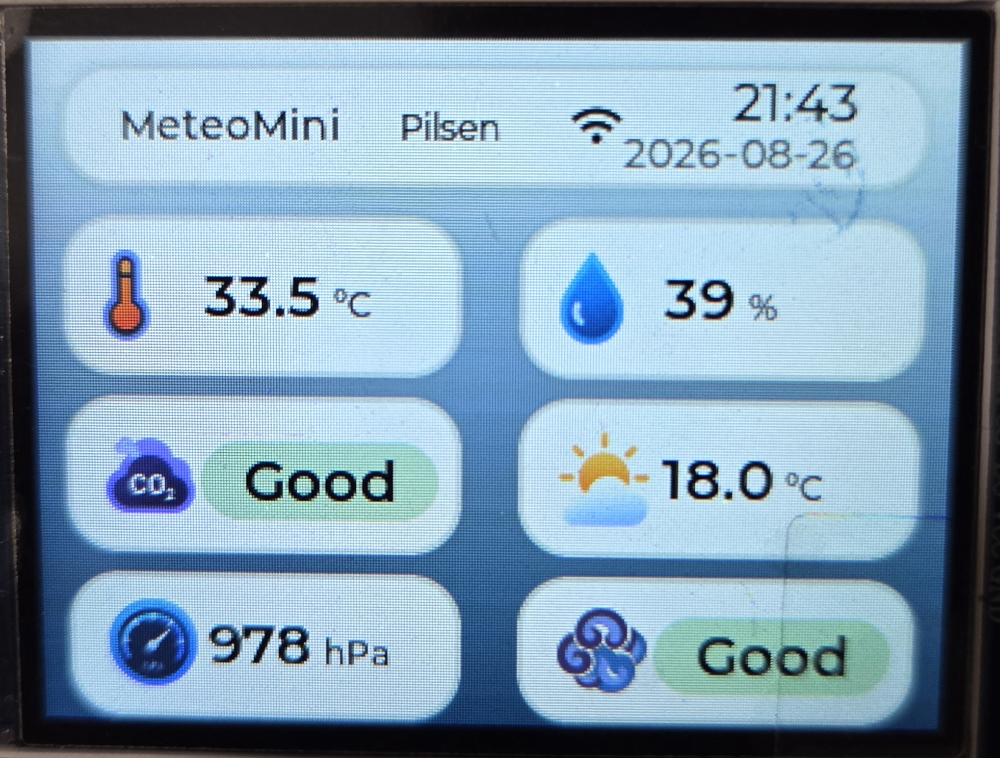
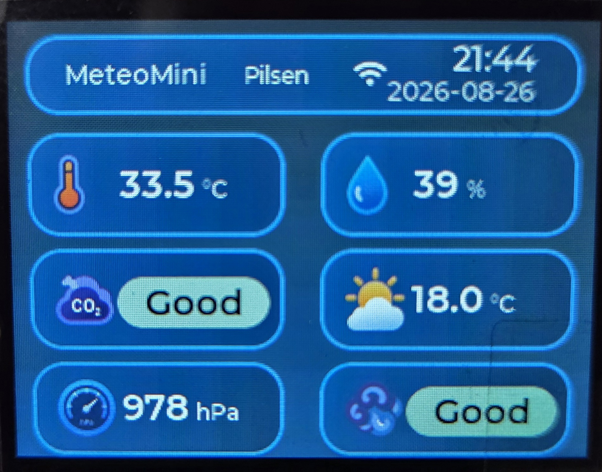

# MeteoMini — Smart Weather Station

## 1. Project Overview

MeteoMini is a compact IoT-based weather station designed for real-time environmental monitoring, data visualization and historical analysis.

The system combines embedded electronics, environmental sensors, a local display and a web-based interface. Sensor data is collected by the embedded controller, processed by the firmware and presented to the user through the local display and web dashboard.

The web interface provides several functional sections, including Dashboard, Weather, History, Settings and About. These sections allow the user to monitor current environmental conditions, review historical measurements and configure the system.

The local display provides direct access to the current measurements. MeteoMini also includes Day and Night display modes to provide a more comfortable interface under different lighting conditions.

The project is designed as a modular platform that can be extended with additional sensors, monitoring functions and software features.

---

## 2. System Architecture

MeteoMini consists of several interconnected subsystems:

* **Embedded Controller** — controls the sensors, processes measurements and manages the system logic.
* **Environmental Sensors** — collect physical weather parameters from the surrounding environment.
* **Local Display** — provides real-time information directly on the device.
* **Web Interface** — provides remote access to measurements and system functions.
* **Data History** — stores previously collected measurements for later analysis.
* **Configuration System** — allows the user to adjust available system parameters.

The general data flow can be represented as:

**Sensors → Embedded Controller → Data Processing → Display / Web Interface → Historical Data**

---

## 3. User Interface

MeteoMini provides a web-based interface divided into several functional sections.

### 3.1 Dashboard

The Dashboard provides a general overview of the current system status and environmental measurements.

  

  <b>Figure 1. MeteoMini Dashboard</b>

### 3.2 Weather

The Weather section provides detailed information about the current environmental conditions measured by the station.

  

  <b>Figure 2. Weather Monitoring Interface</b>

### 3.3 History

The History section allows previously collected measurements to be reviewed and analyzed over time.

  

  <b>Figure 3. Historical Weather Data</b>

### 3.4 Settings

The Settings section provides configuration options for the MeteoMini system.

  

  <b>Figure 4. MeteoMini Settings Interface</b>

### 3.5 Night Mode

MeteoMini includes a dedicated Night Mode for operation in low-light environments.

  

  <b>Figure 5. Night Mode Interface</b>

---

## 4. Local Display

The local display provides direct access to current environmental measurements without requiring a separate computer or mobile device.

### 4.1 Day Mode

  

  <b>Figure 6. MeteoMini Display — Day Mode</b>

### 4.2 Night Mode

  

  <b>Figure 7. MeteoMini Display — Night Mode</b>

---

## 5. System Information

The About section provides general information about the MeteoMini system and software.

  

  <b>Figure 8. MeteoMini About Section</b>

